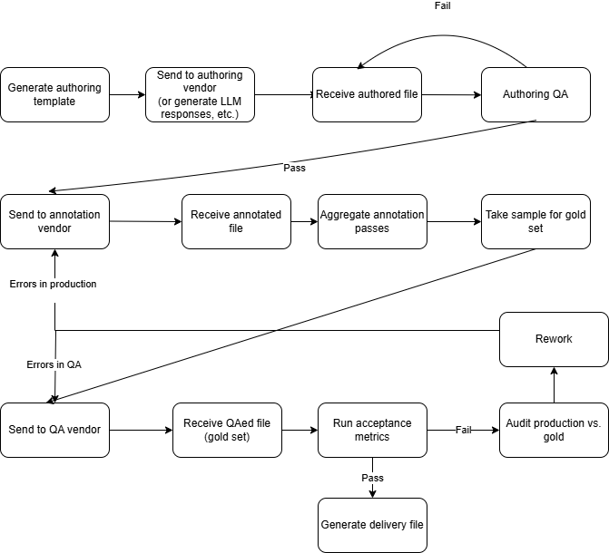

It's about time for me to introduce the main project that I've been working on at the Recurse Center. This is a pipeline for collecting annotated text data for AI training and benchmarking. I'm working on this because it's a fairly complex real-world process, it involves an area of my expertise (language data), and I'll get to learn hands-on about orchestrators and other data engineering tools.   

## Data collection process

I'm still exploring data engineering, but I get the impression that in the most typical case, you have large pre-existing data sources (like a database of customer transactions on your e-commerce website), and your job is to transform it into information that will be helpful for your business in some way. 

That is markedly different from the AI/ML data collection process I describe here, in which your goal is to create small hand-crafted batches of annotated data that meet a quality threshold. Here are some characteristics of this process: 

- The datasets are fairly small (on the order of 1000s to 10,000s of rows)
- They contain natural language data: either written by humans, retrieved from an existing source, or generated by LLMs
- Each row is accompanied by metadata (inherent to the row) and labels (to be provided by annotators)
- The datasets are usually divided into smaller batches for gradual/incremental data delivery
- These datasets must reach a threshold of one or more QA metrics (IAA measures such as Cohen's kappa or Krippendorff's alpha; P/R/F1, etc.) They often undergo multiple iterations of annotation to reach the desired quality. 
- Datasets are authored and annotated by what I will call "annotation resources". Examples of these could be data vendors, crowdsourcing platforms, an internal linguist team, or even an automated LLM labeling process. Multiple annotation resources may work on a single project.

## Problem definition
- The naive approach to handling these datasets is manual: data is processed in Python scripts or notebooks, and data is passed back and forth in the form of csv/json files on file storage.
- This approach causes problems such as:
    - No single source of truth for dataset state
    - Large amounts of repetitive manual work such as downloading files and running scripts
    - Brittleness of pipeline to minor format changes

## Workflow

Below is a sample of one possible workflow for collecting this type of annotated data. I've intentionally designed this workflow to demonstrate as many complexities as possible. 

Note that this workflow features cycles. If data doesn't meet the quality threshold, it gets sent back to the annotation resource for re-work. I'm interested to learn how to handle these cycles in an orchestrator. It's not lost on me that DAG stands for "directed *acyclic* graph", but I'm thinking that this could be handled by re-materializing at the offending step in dagster, for example. 

## My work so far

- I've implemented the first four steps of the above flowchart in [Dagster](https://dagster.io/), a data orchestration platform that was recommended to me by several Recursers. 
- I'm using [duckdb](https://duckdb.org/) for the database. For someone who usually works in Python/dataframes, this has been a natural way to get accustomed to writing SQL queries. I'm guessing I'd need to use a cloud database service in a real production scenario, but I don't have a good sense of how to pick one. 
- I'm using a subset of the [Europarl](https://huggingface.co/datasets/Helsinki-NLP/europarl) dataset. I chose this dataset because it's multilingual (my favorite), and features a lot of different language pairs, so I can enjoy trying to decipher European languages I don't know while glancing at the data.  
  
  ## What's next 

I'm going to continue to implement steps from the pipeline in Dagster, but I'm not sure if I'm going to have time to finish all of them by the end of my time at the Recurse Center. At some point, I need to stop and think about how to package this up into a coherent portfolio project. Your input also welcome! 